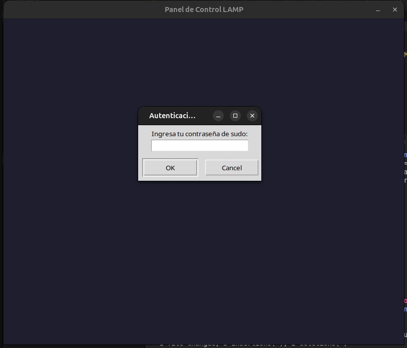
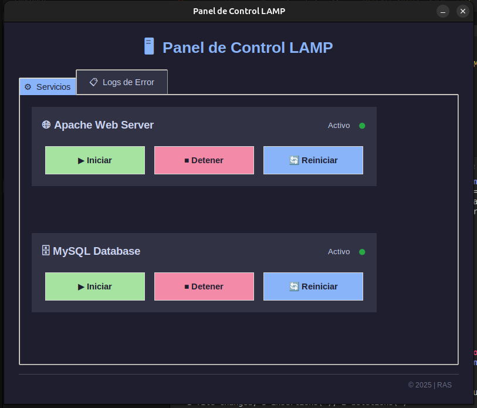
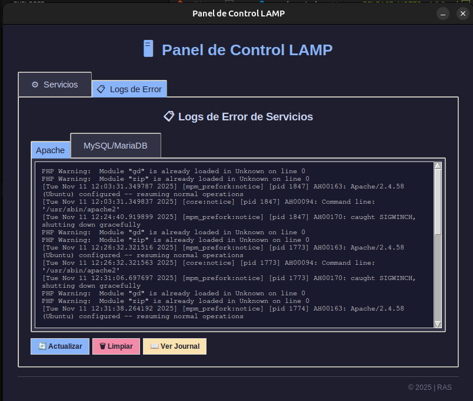

# 🖥️ Panel de Control LAMP

<div align="center">


**Panel de control gráfico profesional para gestionar servicios LAMP en sistemas basados en Debian**

[Características](#-características) •
[Instalación](#-instalación) •
[Uso](#-uso) •
[Documentación](docs/README.md) •
[Contribuir](docs/CONTRIBUTING.md)

</div>

---

## 📋 Características

- ✅ **Interfaz gráfica moderna** con diseño por pestañas
- ⚙️ **Control completo de servicios**
  - Apache Web Server (iniciar, detener, reiniciar)
  - MySQL/MariaDB Database (iniciar, detener, reiniciar)
- 🚦 **Indicadores de estado en tiempo real**
- 📋 **Visor de logs de error**
  - Logs tradicionales de archivos
  - Logs desde systemd journal
  - Búsqueda inteligente de logs
- 🔐 **Autenticación con contraseña única** (se pide solo una vez por sesión)
- 🎨 **Tema oscuro elegante** (Catppuccin inspired)
- 🏗️ **Arquitectura modular** y fácil de mantener
- 🐧 **Compatible con derivados de Debian** (Ubuntu, Mint, Pop!_OS, etc.)

## 📦 Instalación Rápida

> **⚠️ Requisito previo**: Necesitas tener Apache y MySQL/MariaDB instalados.
> 
> Si aún no los tienes:
> ```bash
> sudo apt-get install apache2 mysql-server
> # o MariaDB: sudo apt-get install apache2 mariadb-server
> ```

### Opción 1: Script de Instalación (Recomendado)

```bash
git clone https://github.com/facultadautodidacta/lamp-control-panel.git
cd lamp-control-panel/scripts
sudo ./install.sh
```

### Opción 2: Paquete .deb

```bash
# Descargar desde Releases
wget https://github.com/facultadautodidacta/lamp-control-panel/releases/download/v1.0.0/lamp-control-panel_1.0.0_all.deb
sudo dpkg -i lamp-control-panel_1.0.0_all.deb
sudo apt-get install -f
```

### Opción 3: Ejecución desde código fuente

```bash
git clone https://github.com/facultadautodidacta/lamp-control-panel.git
cd lamp-control-panel
sudo apt-get install python3 python3-tk python3-pil python3-pil.imagetk
python3 src/panel_control.py
```

## 🚀 Uso

```bash
# Desde el menú de aplicaciones
Busca "Panel de Control LAMP"

# Desde terminal
lamp-panel
```

## � Capturas de Pantalla

### Autenticación


### Panel de Servicios


### Visor de Logs


## �📁 Estructura del Proyecto

```
lamp-control-panel/
├── src/                    # Código fuente Python
│   ├── panel_control.py   # Aplicación principal
│   ├── config.py          # Configuración
│   ├── servicios.py       # Gestor de servicios
│   └── componentes.py     # Componentes UI
├── assets/                # Recursos
│   ├── logo.png          # Logo principal
│   └── lamp-icon.ico     # Icono multi-tamaño
├── scripts/               # Scripts de instalación
│   ├── install.sh        # Instalador
│   ├── uninstall.sh      # Desinstalador
│   └── build-deb.sh      # Constructor .deb
├── packaging/             # Archivos de empaquetado
│   └── debian/           # Estructura Debian
├── docs/                  # Documentación
│   ├── README.md         # Documentación completa
│   ├── CONTRIBUTING.md   # Guía de contribución
│   └── screenshots/      # Capturas de pantalla
├── LICENSE               # Licencia MIT
└── .gitignore           # Exclusiones de Git
```

## 📚 Documentación Completa

Para más detalles, consulta la [documentación completa](docs/README.md).

## 🤝 Contribuir

¡Las contribuciones son bienvenidas! Lee nuestra [guía de contribución](docs/CONTRIBUTING.md).

## 📝 Licencia

Este proyecto está bajo la Licencia MIT. Ver [LICENSE](LICENSE) para más detalles.

## 👨‍💻 Autor

**RAS (Roldan Aquino)** - [facultadautodidacta](https://github.com/facultadautodidacta)

---

<div align="center">

**Desarrollado con ❤️ para la comunidad LAMP**

⭐ Si este proyecto te ayuda, dale una estrella en GitHub!

</div>
